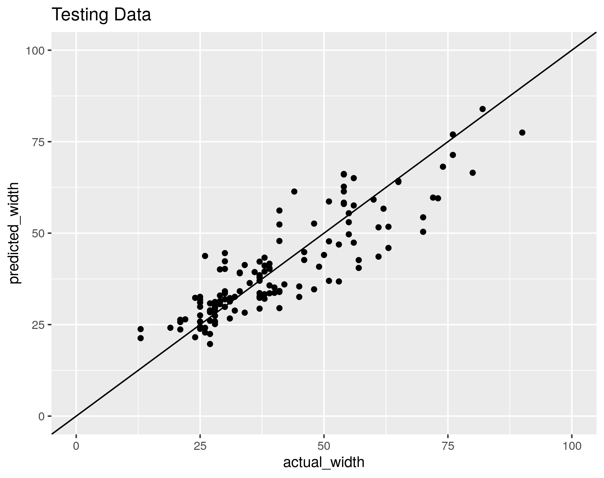

# bike_lane

Machine learning to estimate Road Widths in Tuscaloosa, AL for eventual bike lane introductions.

## R Code

Satellite photo imports, prediction analysis

## Python Code

VGG13 retraining

## Example Road Width Estimates

Link for University Boulevard Estimates:
[University Boulveard: Tuscaloosa, AL](https://www.google.com/maps/d/u/0/edit?mid=1n0QWTH98TX7w4LPvn3XVKhTRYzA98fFh&usp=sharing)

## Test data performance

